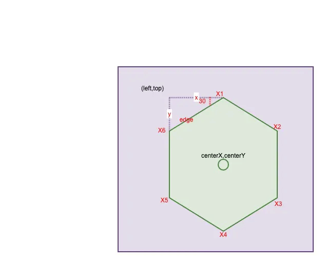

<!--
 * @Author: xx
 * @Date: 2021-06-23 19:54:00
 * @LastEditors: 青峰
 * @LastEditTime: 2021-06-23 20:19:35
 * @FilePath: /vue-press/docs/canvas/README.md
-->

# canvas

> 可以理解为控制一支笔在画布上画图，通过坐标设置起点终点，弧度等等来实现不同的图形

## 获取canvas

```js
var canvas = document.getElementById('tutorial');
//获得 2d 上下文对象
var ctx = canvas.getContext('2d');
```

## 绘制基本类型


```<canvas>``` 只支持两种形式的图形绘制：矩形和路径（由一系列点连成的线段）,其它可以通过绘制路径来实现。

```js
 ctx.fillStyle = 'rgba(0, 0, 200, 0.5)'; // 设置颜色
 ctx.strokeRect(95,5,60,65);
 ctx.fillRect(100,10,50,55);  // 绘制填充矩形
 strokeRect(x, y, width, height) // 绘制一个矩形的边框
```

## 绘制路径

基本步骤

1. 创建路径起始点
2. 调用绘制方法去绘制出路径
3. 把路径封闭
4. 一旦路径生成，通过描边或填充路径区域来渲染图形。

```js
beginPath()

新建一条路径，路径一旦创建成功，图形绘制命令被指向到路径上生成路径

moveTo(x, y)

把画笔移动到指定的坐标(x, y)。相当于设置路径的起始点坐标。

closePath()

闭合路径之后，图形绘制命令又重新指向到上下文中

stroke()

通过线条来绘制图形轮廓

fill()

通过填充路径的内容区域生成实心的图形
```

## 例子

### 雷达图

#### 分析

1. 先画最里面的六边形
2. 往外一层层绘制其它六边形
3. 连线
4. 根据数据描点，填充图形
5. 设置文字

绘制一个六边形有以下几个关键点：



1. 紫色矩形区域我们可以看成是 canvas 的画布。其大小可以认为是 (width,height)。center(centerX,centerY) 是其中心点，即 (width / 2, height / 2)。
2. 绘制六边形的关键是计算出它的 6 个顶点的坐标。而如上图所示，这里面最关键的又是计算出六边形所在矩形区域的左上角坐标(left,top)

[开始白嫖](https://zhuanlan.zhihu.com/p/37089892)

#### 最终代码

封住绘图函数```radar.js

```js

let ctx; // canvas实例
let numCount = 6; // 边的个数
let numSlot = 5; // 节点数（几个级别）
let mW = 400;
let mH = 400;
let mCenter;// 中心点
let mAngle; //角度(用于确定点的坐标)
let mRadius; //半径(减去的值用于给绘制的文本留空间)


/**
 * 
 * @param {Object} ctx canvas实例
 * @param {Array<{data:Array<{type,number}>,color}>} sourceData 需要渲染的数据组
 * @param {Array} pointName  各点的类型名
 * @param {Object} options canvas配置
 */
function drawRadar(canvasInstance, sourceData, pointName, options) {
  const {
    lineColor = 'grey',
    font = 'bold 17px cursive',
    lineWidth = 2,
    count = 6,
    slot = 5,
    quotaFont = 'bold 17px cursive',
    quotaColor = 'grey',
    width = 400,
    height = 400
  } = options;
  mW = width;
  mH = height;
  numCount = count;
  numSlot = slot;
  mCenter = mW / 2;
  mAngle = Math.PI * 2 / numCount;
  mRadius = mCenter - 60;
  ctx = canvasInstance;
  ctx.width = mW;
  ctx.height = mH;
  ctx.strokeStyle = lineColor; // 设置线的颜色
  ctx.lineWidth = lineWidth;  //设置线宽
  ctx.font = font; // 设置字体


  // 画多边形及节点连线
  drawEdge()
  drawLinePoint()

  //设置数据
  sourceData.forEach(item => {
    drawRegion(item.data, item.color ? item.color : getRandomRgb);
  });

  //设置文本数据
  drawTextCans(pointName, quotaColor, quotaFont)

  //设置节点
  // this.drawCircle(sourceData1, 'red')
};

/**
 * 绘制多边行
 */
function drawEdge() {
  for (var i = 0; i < numSlot; i++) {
    //计算半径
    ctx.beginPath()
    var rdius = mRadius / numSlot * (i + 1)
    //画6条线段
    for (var j = 0; j < numCount; j++) {
      //坐标
      var x = mCenter + rdius * Math.cos(mAngle * j);
      var y = mCenter + rdius * Math.sin(mAngle * j);
      ctx.lineTo(x, y);
    }
    ctx.closePath()
    ctx.stroke()
  }
};

// 绘制连接点
function drawLinePoint() {
  ctx.beginPath();
  for (var k = 0; k < numCount; k++) {
    var x = mCenter + mRadius * Math.cos(mAngle * k);
    var y = mCenter + mRadius * Math.sin(mAngle * k);
    ctx.moveTo(mCenter, mCenter);
    ctx.lineTo(x, y);
  }
  ctx.stroke();
};

//绘制数据区域(数据和填充颜色)
function drawRegion(mData, color) {
  ctx.beginPath();
  for (var m = 0; m < numCount; m++) {
    var x = mCenter + mRadius * Math.cos(mAngle * m) * mData[m].number / 100;
    var y = mCenter + mRadius * Math.sin(mAngle * m) * mData[m].number / 100;
    ctx.lineTo(x, y);
  }
  ctx.closePath();
  ctx.fillStyle = color;
  ctx.fill();
};

//绘制文字
function drawTextCans(pointNames, quotaColor, quotaFont) {
  ctx.fillStyle = quotaColor;
  ctx.font = quotaFont //设置字体
  pointNames.forEach((type, n) => {
    var x = mCenter + mRadius * Math.cos(mAngle * n);
    var y = mCenter + mRadius * Math.sin(mAngle * n);
    //通过不同的位置，调整文本的显示位置
    if (mAngle * n >= 0 && mAngle * n <= Math.PI / 2) {
      ctx.fillText(type, x + 5, y + 5);
    } else if (mAngle * n > Math.PI / 2 && mAngle * n <= Math.PI) {
      ctx.fillText(type, x - ctx.measureText(type).width - 7, y + 5);
    } else if (mAngle * n > Math.PI && mAngle * n <= Math.PI * 3 / 2) {
      ctx.fillText(type, x - ctx.measureText(type).width - 5, y);
    } else {
      ctx.fillText(type, x + 7, y + 2);
    }
  });
};

//画点
function drawCircle(mData, color) {
  var r = 3; //设置节点小圆点的半径
  for (var i = 0; i < numCount; i++) {
    const data = mData[i];
    var x = mCenter + mRadius * Math.cos(mAngle * i) * data['number'] / 100;
    var y = mCenter + mRadius * Math.sin(mAngle * i) * data['number'] / 100;
    ctx.beginPath();
    ctx.arc(x, y, r, 0, Math.PI * 2);
    ctx.fillStyle = color;
    ctx.fill();
  }
}

/**
 * rgb颜色随机
 */
function getRandomRgb() {
  var r = Math.floor(Math.random() * 256);
  var g = Math.floor(Math.random() * 256);
  var b = Math.floor(Math.random() * 256);
  var rgb = '(' + r + ',' + g + ',' + b + ')';
  return rgb;
}
export default drawRadar;
```

在微信小程序中调用

```js

import drawRadar from './radar'
Page({

  /**
    * 页面的初始数据
    */
  data: {
    sourceData: [{
      data: [{ type: "战绩", number: 88 }, { type: "生存", number: 74 }, { type: "团战", number: 74 }, { type: "发育", number: 24 }, { type: "输出", number: 72 }, { type: "推进", number: 95 }],
      color: 'rgba(28,187,180,0.7)'
    },
    {
      data: [{ type: "战绩", number: 53 }, { type: "生存", number: 32 }, { type: "团战", number: 65 }, { type: "发育", number: 34 }, { type: "输出", number: 89 }, { type: "推进", number: 99 }],
      color: 'rgba(28,187,100,0.7)'
    }],
    positonName: ["战绩", "生存", "团战", "发育", "输出", "推进"]
  },

  /**
    * 生命周期函数--监听页面初次渲染完成
    */
  onReady: function () {
    const query = wx.createSelectorQuery()
    query.select('#radarCanvas')
      .fields({ node: true, size: true })
      .exec((res) => {
        const canvas = res[0].node
        const ctx = canvas.getContext('2d');
        // 放大模糊处理
        const dpr = wx.getSystemInfoSync().pixelRatio
        canvas.width = res[0].width * dpr
        canvas.height = res[0].height * dpr
        ctx.scale(dpr, dpr)
        drawRadar(ctx, this.data.sourceData, this.data.positonName, {});
      })
  },

})
```
