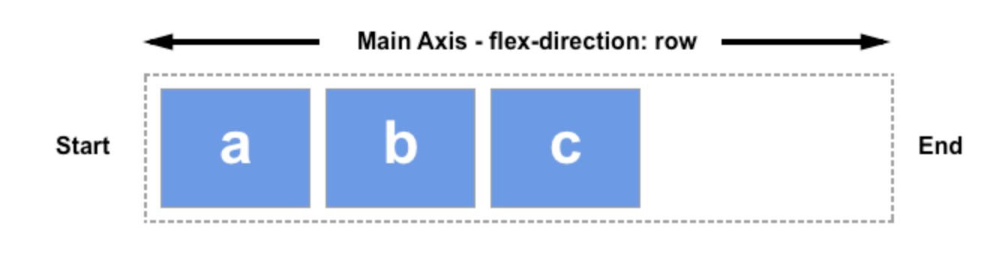
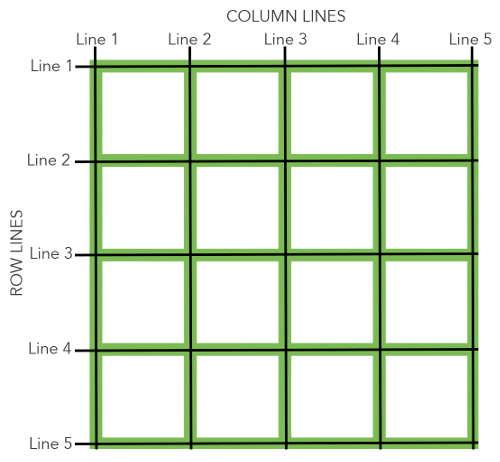
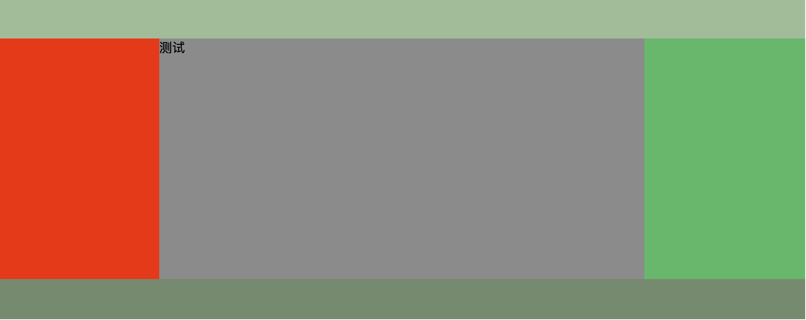

<!--
 * @Author: xx
 * @Date: 2021-06-25 11:11:02
 * @LastEditors: 青峰
 * @LastEditTime: 2021-06-25 11:46:26
 * @FilePath: /vue-press/docs/css-doc/layout.md
-->

[[toc]]

# 布局

## Flex 布局

[mdn 解释](https://developer.mozilla.org/zh-CN/docs/Web/CSS/CSS_Flexible_Box_Layout/Basic_Concepts_of_Flexbox)

### 1. 主轴和交叉轴

1. 主轴由 **flex-direction** 定义

- row--------------inline 方向，水平
- row-reverse------从相反方向开始
- column-----------block 排列的方向，垂直
- column-reverse

  2.交叉轴垂直于主轴

- 主轴水平交叉轴的方向就是沿着列向下的
- 如果主轴方向设成了 column 或者 column-reverse，交叉轴就是水平方向。

### 2. 起始线和终止线

如果 flex-direction 是 row ，并且我是在书写英文，那么主轴的起始线是左边，终止线是右边


### 3. flex 容器

我们把一个容器的 display 属性值改为 flex 或者 inline-flex。 完成这一步之后，容器中的直系子元素就会变为 flex 元素。所有 CSS 属性都会有一个初始值，所以 flex 容器中的所有 flex 元素都会有下列行为：

- 元素排列为一行 (flex-direction 属性的初始值是 row)。
- 元素从主轴的起始线开始。
- 元素不会在主维度方向拉伸，但是可以缩小。
- 元素被拉伸来填充交叉轴大小。
- flex-basis 属性为 auto。
- flex-wrap 属性为 nowrap。

`flex-direction`

> 属性决定主轴的方向

- row（默认值）：主轴为水平方向，起点在左端。
- row-reverse：主轴为水平方向，始线和终止线交换，起点在右端。
- column：主轴交叉轴交换，主轴为垂直方向，起点在上沿。
- column-reverse：主轴为垂直方向，起点在下沿。

`flex-wrap`

> 实现多行 Flex 容器,多主轴

- nowrap 不换行
- wrap 换行，第一行在上方
- wrap-reverse 换行，第一行在下方

`flex-flow`

> 属性简写 `flex-direction` 和 `flex-wrap` 组合为简写属性 `flex-flow`

```css
flex-flow: <flex-direction> || <flex-wrap>;
flex-flow: row wrap-reverse;
```

`justify-content`

> 定义主轴上的对齐方式（不是定义水平居中或垂直居中，取决于主轴的方向）

- flex-start（默认值）：左对齐
- flex-end：右对齐
- center： 居中
- space-between：两端对齐，项目之间的间隔都相等。
- space-around：每个项目两侧的间隔相等。所以，项目之间的间隔比项目与边框的间隔大一倍。

`align-items`

> 属性定义项目在交叉轴上如何对齐

- flex-start：交叉轴的起点对齐。
- flex-end：交叉轴的终点对齐。
- center：交叉轴的中点对齐。
- baseline: 项目的第一行文字的基线对齐。
- stretch（默认值）：如果项目未设置高度或设为 auto，将占满整个容器的高度。

`align-content`

> 多根轴线的对齐方式

- flex-start：与交叉轴的起点对齐。
- flex-end：与交叉轴的终点对齐。
- center：与交叉轴的中点对齐。
- space-between：与交叉轴两端对齐，轴线之间的间隔平均分布。
- space-around：每根轴线两侧的间隔都相等。所以，轴线之间的间隔比轴线与边框的间隔大一倍。
- stretch（默认值）：轴线占满整个交叉轴。

### 4 flex 元素属性

改变了 flex 容器中的可用空间的行为

简写 Flex

```css
flex: none | [ < "flex-grow" > < "flex-shrink" >? || < "flex-basis" > ];
```

`flex-basissfad`

定义元素的空间大小,默认值是 auto,如果没有给元素设定尺寸，flex-basis 的值采用元素内容的尺寸

`flex-grow`

定义增加空间,如果第一个元素 flex-grow 值为 2， 其他元素值为 1，则第一个元素将占有 2/4 另外两个元素各占有 1/4。

`flex-shrink`

定义缩小空间

`align-self`

属性允许单个项目有与其他项目不一样的对齐方式，可覆盖 align-items 属性

```css
align-self: auto | flex-start | flex-end | center | baseline | stretch;
```

## Grid 布局

> 利用行和列产生单元格来布局

### 基本概念

### 容器和项目

容器（container）：采用网格布局的区域。

项目（item）：容器内部采用网格定位的子元素。

**注意**：项目只能是容器的顶层子元素，不包含项目的子元素。Grid 布局只对项目生效。

### 行和列

水平区域为行，垂直区域为列

### 单元格

行和列的交叉区域，称为"单元格"（cell）。

### 网格线

划分网格的线，称为"网格线"（grid line）



### 容器属性

`display`

> 指定一个容器采用网格布局。

```css
display: grid; // 容器为块级元素
display: inline-grid; // 容器为行内元素
```

`grid-template-columns` ,`grid-template-rows`

```css
grid-template-rows: 100px 100px 100px; // 定义行高

grid-template-columns: 100px 100px 100px; // 定义列宽

// repeat
grid-template-columns: repeat(3, 33.33%); // 使用repeat(次数,需要重复的值)化简

// auto-fill
grid-template-columns: repeat(auto-fill, 100px); // 自动填充，尽量填满一行

// fr
grid-template-columns: 150px 1fr 2fr; // fr（对剩余空间划分的单位）

// minmax
grid-template-columns: 1fr 1fr minmax(100px, 1fr); // 最小最大

// auto
grid-template-columns: 100px auto 100px; // 自适应

// 网格线名称
grid-template-columns: [c1] 100px [c2] 100px [c3] auto [c4 last];
```

`gap`

> `grid-row-gap`属性设置行与行的间隔（行间距），`grid-column-gap`属性设置列与列的间隔（列间距）

```css
grid-gap: <grid-row-gap> <grid-column-gap>;
```

`grid-template-areas`

> 网格布局允许指定"区域"（area），一个区域由单个或多个单元格组成

```css
grid-template-areas:
  "header header header"
  "main main sidebar"
  "footer footer footer";
grid-template-areas:
  "a . c"
  "d . f"
  "g . i"; // 如果某些区域不需要利用，则使用"点"（.）表示
```

区域的命名会影响到网格线。每个区域的起始网格线，会自动命名为`区域名-start`，终止网格线自动命名为`区域名-end`。

`grid-auto-flow`

```css
grid-auto-flow: row; // 默认，先行后列
grid-auto-flow: column; // 先例后行
grid-auto-flow: row dense; // "先行后列"，并且尽可能紧密填满。
grid-auto-flow: column dense; // "先列后行"，并且尽可能紧密填满。
```

`place-content`

> justify-content 属性是整个内容区域在容器里面的水平位置（左中右）\
> align-conten 属性是整个内容区域的垂直位置（上中下）。

```css
place-content: <align-content> <justify-content>;
```

- start - 对齐容器的起始边框。

- end - 对齐容器的结束边框。

- center - 容器内部居中。

- stretch - 项目大小没有指定时，拉伸占据整个网格容器。

- space-around - 每个项目两侧的间隔相等。所以，项目之间的间隔比项目与容器边框的间隔大一倍。

- space-between - 项目与项目的间隔相等，项目与容器边框之间没有间隔。

- space-evenly - 项目与项目的间隔相等，项目与容器边框之间也是同样长度的间隔。

  如果省略第二个值，则浏览器认为与第一个值相等

`place-items`

> justify-items 属性设置单元格内容的水平位置（左中右）
>
> align-items 属性设置单元格内容的垂直位置（上中下）。

```css
place-items: <align-items> <justify-items>;
```

- start：对齐单元格的起始边缘。
- end：对齐单元格的结束边缘。
- center：单元格内部居中。
- stretch：拉伸，占满单元格的整个宽度（默认值）。

如果省略第二个值，则浏览器认为与第一个值相等

`grid-auto-columns`,`grid-auto-rows`

> 指定流览器自动创建的多余网格的列宽和行高

写法与`grid-template-columns`和`grid-template-rows`完全相同

### 项目属性

通过指定四个边框的位置来指定项目的位置，实现跨行跨列

`grid-column` ,`grid-row`

> `grid-column`属性是`grid-column-start`和`grid-column-end`的合并简写形式，`grid-row`属性是`grid-row-start`属性和`grid-row-end`的合并简写形式。

```css
.item-1 {
  grid-column: 1 / 3;
  grid-row: 1 / 2;
}
grid-column: 1 / span 2; // 表示跨越几个单元格
```

- `grid-column-start`属性：左边框所在的垂直网格线
- `grid-column-end`属性：右边框所在的垂直网格线
- `grid-row-start`属性：上边框所在的水平网格线
- `grid-row-end`属性：下边框所在的水平网格线

```css
.item-1 {
  grid-column-start: header-start;
  grid-column-end: header-end;
}

.item-1 {
  grid-column-start: 1;
  grid-column-end: 3;
  grid-row-start: 2;
  grid-row-end: 4;
}
```

`grid-area`

> 属性指定项目放在哪一个区域。

```css
grid-area: e; // 放在e区域
```

`grid-area`属性还可用作`grid-row-start`、`grid-column-start`、`grid-row-end`、`grid-column-end`的合并简写形式，直接指定项目的位置

```css
grid-area: <row-start> / <column-start> / <row-end> / <column-end>;
grid-area: 1 / 1 / 3 / 3;
```

`place-self`

> `justify-self`属性设置单元格内容的水平位置（左中右），跟`justify-items`属性的用法完全一致，但只作用于单个项目。
>
> `align-self`属性设置单元格内容的垂直位置（上中下），跟`align-items`属性的用法完全一致，也是只作用于单个项目。

## 常见布局

### 水平，垂直居中

1, flex 实现

```css
display: flex;
justify-content: center;
align-items: center;
```

2, 绝对定位加 transform

`html`

```html
html
<div>
  <div class="child">test</div>
</div>
```

`css`

```css
div {
  width: 200px;
  height: 200px;
  background: red;
  position: relative;
}
.child {
  width: 100px;
  height: 100px;
  background: black;
  positon: absolute;
  top: 50%;
  left: 50%;
  transform: translate(-50%, -50%);
}
```

3.表格布局实现

```css
div {
  display: table-cell;
  vertical-align: middle;
  width: 200px;
  height: 200px;
  background: red;
  text-align: center;
}
.child {
  display: inline-block;
  height: 100px;
  width: 100px;
  background: black;
  vertical-align: middle;
}
```

### 圣杯布局|飞翼布局



**相同**：飞翼布局和圣杯布局都是实现左右两边固定，中间自适应的布局。

**不同**：对中间div内容不被遮挡的处理不同，飞翼布局是通过包裹中间div的方式实现，而圣杯是通过padding实现，圣杯要用到相对布局

---

#### 圣杯布局

大致思路：根据左右div设置父容器padding保证中间div不会被遮挡,左中右全部左浮动然后通过给左右div设置负边距实现同行，然后通过设置左右相对布局来调整位置

`html`

```html

<div class="header"></div>
<div class ="container">
  <div class="center">测试</div>
  <div class="left"></div>
  <div class="right"></div>
</div>
<div class = "footer"></div>
```

`css`

```css
.container {
 padding: 0 200px 0 200px;
}

.left {
 background: red;
 width: 200px;
 height: 300px;
 float: left;
/*   向左移动整个宽度 */
 margin-left: -100%;
 position: relative;
/*   边距已经是负的，正的会抵消*/
 left: -200px;
}

.center {
 float: left;
 background: grey;
 height: 300px;
 width: 100%;
}

.right {
 background: black;
 height: 300px;
 width: 200px;
 float: left;
 margin-left: -200px;
 position: relative;
 left: 200px;
}

.header {
 width: 100%;
 height: 50px;
 background: green;
}

.footer {
 width: 100%;
 height: 50px;
 background: green;
 clear: both;
}

```

#### 飞翼布局

大致思路：和圣杯一样，通过左浮动和负边距使三个div在同一行，不同的是选择在中间div外再套一层div然后对中间div设置margin来实现内容不被遮挡,应为中间div的父元素没有设置边距所以左右div也不用使用相对布局来调整位置

`html`

```html
<div class="header"></div>
<div class="center">
  <div class ="center-box">测试</div>
</div>
<div class = "left"></div>
<div class ="right"></div>
<div class="footer"></div>
```

`css`

```css
.left {
 background: red;
 width: 400px;
 height: 300px;
 float: left;
 margin-left: -100%
}

.center {
 background: grey;
 height: 300px;
 width: 100%;
 float: left;
}

.center-box {
 margin: 0 200px 0 400px;
}

.right {
 background: black;
 height: 300px;
 width: 200px;
 float: left;
 margin-left: -200px;
}

.header {
 width: 100%;
 height: 50px;
 background: green;
}

.footer {
 width: 100%;
 height: 50px;
 background: green;
 clear: both;
}
```
