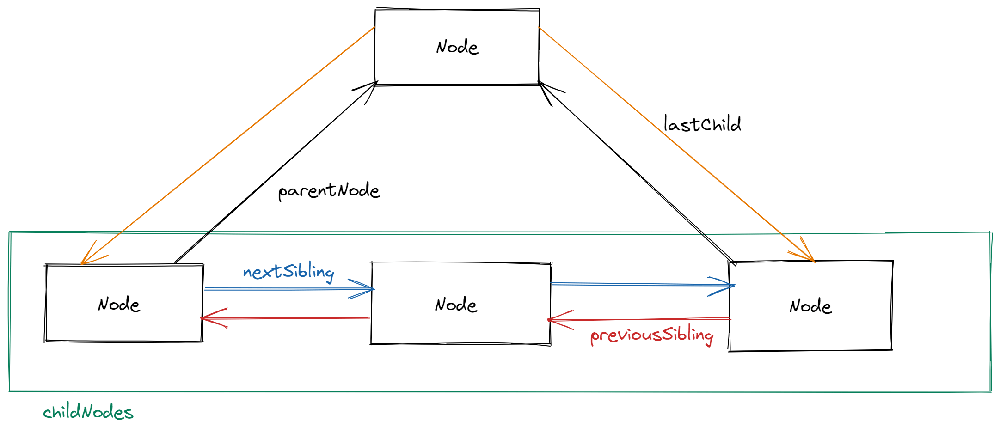
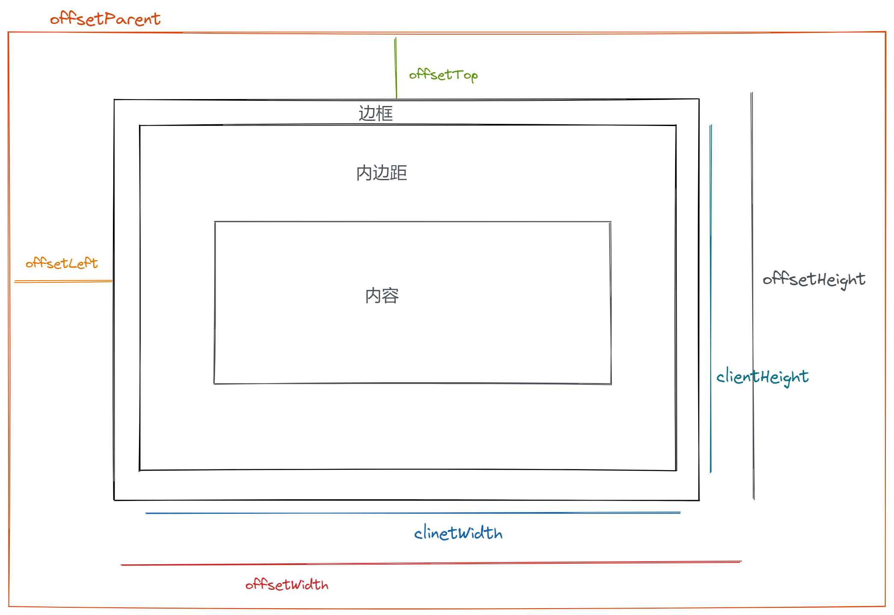

[[toc]]

# DOM

dom 是针对 html 和 xml 文档的一个 API 。 描述了一个层次化的节点树。

## Node 类型

> 该接口由 DOM 中的所有节点实现，在 Javascript 中作为 Node 类型是实现。

### `nodeType` 节点类型

- Node.ELEMENT_NODE  `1` 一个元素节点，例如 `
` 和 `
`。
- Node.TEXT_NODE `3` Element 或者 Attr 中实际的文字
- Node.CDATA_SECTION_NODE `4` 一个 CDATASection，例如 `<!CDATA[[ … ]]>`。
- Node.PROCESSING_INSTRUCTION_NODE `7` 一个用于XML文档的 ProcessingInstruction (en-US) ，例如 `<?xml-stylesheet ... ?>` 声明。
- Node.COMMENT_NODE `8` 一个 Comment 节点。
- Node.DOCUMENT_NODE `9` 一个 Document 节点。
- Node.DOCUMENT_TYPE_NODE `10` 描述文档类型的 DocumentType 节点。例如 `<!DOCTYPE html>`  就是用于 HTML5 的。
- Node.DOCUMENT_FRAGMENT_NODE `11` 一个 DocumentFragment 节点

可通过 `nodeName` 获取节点名，以及 `nodeValue` 获取值

### 节点关系

#### `NodeList`

> NodeList 是一种类数组对象，与对象有相同行为，但是不是 `Array` 的实例;也是动态变化的，是基于 `DOM` 结构动态执行查询的就结果。

访问 `NodeList`

可以通过方括号下标访问，或者 `item(index)` 访问。

- `childNodes`

每个节点都有一个 `childNodes` 属性，其中保存着 `NodeList`，表示当前节点的子节点合集。

- `parentNode`

每个节点都有一个 `parentNode` 属性，指向文档树中的父节点。

- `previousSibling` 和 `nextSibling`

`childNodes` 中的每个节点之间都是兄弟节点，可以通过上面两个访问前一个和后一个兄弟节点，没有时返回 `null`。

### 操作节点

- `appendChild(newNode)` 向末尾添加节点,返回插入的节点。
- `insertBefore(newNode,TargetNode)` 向 `TargetNode` 前添加一个节点，返回插入的节点。
- `replaceChild(newNode,TargetNode)` 返回被替换的节点。
- `removeChild(TargetNode)` 返回被移除的节点。
- `cloneNode(TargetNode)` 复制当前节点，接受一个布尔值参数，表示是否进行深复制。

## Document 类型

> JavaScript 通过 Document 类型表示文档。document 对象是 window 对象的一个属性

### 子节点

`Document` 节点的子节点可以是 `DocumentType`、`Element`、`ProcessingInstruction` 或 `Comment`

### 文档信息

- `title` `<title></title>` 元素中的文本
- `URL` 地址栏中显示的 URL
- `domain` 域名
- `referrer` 拦截到当前页面的那个页面的 `URL`

### 查找元素

`getElementById()`

接受一个 id 作为参数，区分大小写，返回查找到的第一个元素

`getElementByTagName()` 和 `getElementByName`

接受名称做为参数，返回 HTMLCollection 对象，与 NodeList 类似， `HTMLCollection[下标|字符串]` 会调用不同的方法来查找具体某个元素。

特殊的 HTMLCollection 集合

- `document.anchors` 所有带 name 特征的 `` 元素
- `document.forms` 所有表单元素
- `document.images` 所有的图片元素
- `document.links` 所有带 href 特征的 `` 元素

`querySelector()` 和 `querySelectorAll()`

传入一个 css 选择符，querySelector 返回匹配的第一个，querySelectorAll 返回一个 NodeList 实例

`getElementByClassName()`

接受包含一个或多个类名的字符串，空格分开，返回带有指定类的所有元素的 NodeList

### 文档写入

`write()`  和 `writeIn()`

接受字符串 ,`write()`  原样写入 , `writeIn()` 在末尾添加一个换行符（\n）

`open` 和 `close`

这两个方法用于打开和关闭网页的输出流，在页面加载期间不需要用到。

## Element 类型

### HTML 元素

所有的 HTML 元素都由 HTMLElement 表示，常见属性如下：

- id 唯一标识符
- title 附加说明，鼠标悬浮会显示
- className 元素的 class

可以通过 `getAttribute()` 来获取，`setAttribute()` 来设置，以及 `removeAttribute()` 来移除。

### classList

更加方便的操作元素的类名，返回 DOMTokenList 集合，包含如下方法

- add(value) 添加，已存在则不会添加
- contains(value) 检测是否存在
- remove(value) 删除指定字符串
- toggle(value) 如果列表中已经存在则删除，否则添加

### attributes 属性

Element 类型是使用 attributes 属性的唯一一个 DOM 类型节点，attributes 中包含一个 NameNodeMap，与 NodeList 类似，元素的每一个特征都由一个 Attr 节点表示，每个节点都保存在 NameNodeMap 中。attributes 有以下属性和方法

- `getNamedItem(name)`
- `removeNamedItem(name)`
- `setNamedItem(node)`
- `item(index)`

### 创建元素

`createElement()` 接受一个标签名作为参数，不区分大小写

### 元素子节点

`childNodes` 属性包含了元素所有的子节点，不同浏览器对空白行的处理不一样，需要用 nodeType 判断节点类型

## Text 类型

> Text 类型表示纯文本内容，没有子节点

`createTextNode` 创建一个文本节点，一般每个元素只有一个文本子节点，`normalize()` 方法可以多个同胞文本节点合并为一个。`splitText()` 则可以按指定位置分割 nodeValue 值。

## Comment 类型

> 注释在 DOM 中通过 comment 类型表示，没有子节点

## DocumentFragment

> 一种轻量级的文档，可以包含和控制节点，但是不占用额外的资源，一般作为仓库，临时存储，防止频繁操作 DOM 频繁的重绘及回流

通过 `createDocumentFragment` 创建一个文档片段

## 焦点管理

`document.activeElement` 指向当前 DOM 中获得焦点的元素。

`document.focus` 检测文档是否获取了焦点。

## 插入

### 插入标记

`innerHTML` 读模式下返回调用元素的所有子节点对应的HTML标记，写模式会根据指定的值创建 DOM 树，然后替换调用元素所有的子节点。

`outerHTML` 与 inner 相同，但是包含调用的元素自身。

### 插入文本

`innerText` 和 `outerText` 行为与插入标记相同。

## 滚动

`scrollIntoView` 让元素展示在可视区域，接受一个参数如果为true，元素的顶端将和其所在滚动区的可视区域的顶端对齐。这是这个参数的默认值。如果为false，元素的底端将和其所在滚动区的可视区域的底端对齐。

`scrollIntoViewIfNeeded` 当元素不可见是才发生滚动，否则不做操作。

`scrollByLines` 将元素滚动到指定行高。

`scrollByPages` 将元素滚动到指定页面高度。

## 样式

> THML 中有3种方式定义样式 `<link/>` `<style/>` 以及 `style` DOM2级样式针对这三种应用样式的机制提供了一套 API 

访问元素样式

HTML 元素有一个对应的 `style` 属性，可将 css 属性转换为小驼峰然后访问，float 属性比较特殊，对应为 `cssFloat`。只包含自身的样式，通过 `document.defaultView.getComputedStyle` 访问外部或嵌套叠层的样式。

## 元素大小 

### 偏移量

`offsetHeight` `offsetWidth` `offsetLeft` `offsetTop` 边框到父元素边框的距离

### 客户端大小

### 滚动大小

`scrollHeight` `...with` `...left` `...top` 从内边距开始计算，不包含边框。