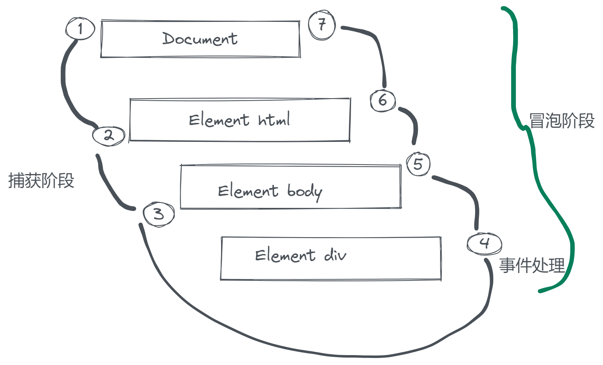

[[toc]]
# 事件

HTML 与 Javascript 之间的交互通过事件来实现

## 事件流

> 在纸上画一组同心圆，如果你把手指放在圆心上，那么你的手指指向的不是一个圆，而是纸上所有的圆

DOM 事件流包过三个阶段：事件捕获、处于目标、事件冒泡



## 事件处理程序

1. HTML 事件处理程序

- 可以通过与事件处理程序同名的 HTML 特性来指定

```js
<input type="button" value="xxx" onclick="alert('Clicked')">
```

2. DOM0级事件处理程序

获取到元素对象后直接设置事件处理程序属性 `btnElement.onclick = function(){}`

3. DOM2级事件处理程序

通过 `addEventListener()` 和 `removeEventListener()` 添加或删除。接受三个参数：要处理的事件名、处理函数、处理阶段（`true`表示捕获阶段，默认 `false` 冒泡阶段）。

**注册多个会触发多个，匿名函数注册无法被删除。**

## 事件对象

事件被触发时会将一个 `event` 对象传入到事件处理程序中。

event 对象常见属性和方法

- `preventDefault()` 取消事件的默认行为
- `stopImmediatePropagation()` 取消事件的进一步捕获或冒泡，同时阻止任何事件处理程序被调用
- `stopPropagation()` 取消事件的进一步捕获或冒泡
- `target` 时间的目标
- `type` 被触发事件的类型

## 事件类型

常用事件类型：UI事件、焦点事件、鼠标事件、文本事件。

- `load`

当页面完全加载后在 window 上触发;框架加载完成在框架上面触发;图像加载完在 `` 元素上面触发;嵌入的内容加载完在 `<object>` 上面触发

- `error`

发生错误时触发，触发环境和 `load` 一样

- `resize`

窗口或框架大小变化时触发

- `scroll`

当滚动带滚动条的元素中的内容时，在元素上触发。

- `blur`

失去焦点时触发，不冒泡。

- `focus`

获得焦点时触发，不冒泡。

### 鼠标和滚轮事件

- `click` 单机左键或者按下回车。

    点击鼠标出发顺序 `mousedown` `mouseup` `click` 。

- `dbclick` 鼠标双击

查看鼠标事件的位置

1. `clientX` 和 `clientY` 表示视窗位置
2. `pageX` 和 `pageY` 表示页面中的位置（包含滚动）
3. `screenX` 和 `screenY` 表示相对于整个屏幕的位置

`mousewheel` 鼠标滚轮事件

### 键盘事件

`keydown` 键盘按下任意键

`keyup` 键释放

`textInput` 可编辑区域，按下能够输入字符的键时触发

触发键盘事件时 event 对象的 `code` 属性会包含一个编码， `key` 字符串。

[code](https://developer.mozilla.org/zh-CN/docs/Web/API/KeyboardEvent/code)

event 对象还有一个 `inputMethod` 属性，表示文本输入到文本框中的方式（粘贴、拖放、语音等）

[事件类型参考](https://developer.mozilla.org/en-US/docs/Web/Events)

### 变动事件

`DOMSubtreeModified` 在 DOM 结构中发生任何变化时触发

还有节点添加、删除等事件

`contextmenu` 单击鼠标右键时触发，可以通过这个事件获取鼠标位置来自定义右键菜单。

`DOMContentLoaded` DOM 树形成之后会触发。

### 移动端事件

兼容性未知

`orientationchange` 查看模式切换，横屏竖屏。

`deviceorientation` 检测设备变化,三维空间。

`devicemotion` 检测设备移动

以 toch 开头的一系列触摸事件 如 `touchstart` 及触摸滑动、结束、特定对象触摸监听。

多指手势事件。

**大量的事件订阅及处理可能会带来内存和性能问题，对于点击和鼠标事件适当的采用委托；对于滚动及高频率触发的事件可以结合需求来进行防抖或节流**

